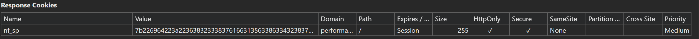
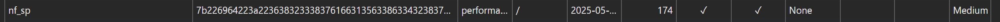

# Getting started

Welcome to the Netlify Skew Protection package documentation, a library designed to seamlessly implement [Skew Protection](https://www.industrialempathy.com/posts/version-skew/) on your [Netlify](https://www.netlify.com/) site. This guide will show you how the package works to prevent version skew issues in your application and walk you through the steps to get it set up.

## Problem

When deploying a new version of a static frontend application, users who are still browsing the previous version may encounter `404` errors for static assets like JavaScript or CSS files. This happens because the new deployment instantly replaces the old one, but users' files still reference asset filenames that were unique to the previous deployment. As a result, when a user navigates to a page during this transition, the browser requests files **may no longer exist**, leading to broken pages and degraded user experience. At Workleap, version skew most commonly occurs with [lazy-loaded routes](https://react.dev/reference/react/lazy).

## Solution

Skew Protection addresses this by maintaining a consistent experience for each user session. It does so by **assigning a cookie when** a user first fetch the entry point, **tying** that **session** to a specific **deployment id**. All subsequent asset requests are routed to that specific deploy URL (e.g., `https://deploy-id--your-site.netlify.app`), ensuring that users always receive the correct asset versions associated with the deployment they were served initially. This prevents asset mismatches and eliminates `404` errors caused by mid-session deploy transitions, resulting in smoother, safer releases.

## Set up Skew Protection

To enable Skew Protection on your Netlify site, you'll need to follow four key steps:

1. [Create the Edge Function](#create-the-edge-function)
2. [Register the Edge Function](#register-the-edge-function)
3. [Build the Edge Function](#build-the-edge-function)
4. [Provide a secret](#provide-a-secret)

### Create the Edge Function

Netlify's mechanism for intercepting and rerouting CDN requests is called [Edge Functions](https://docs.netlify.com/edge-functions/overview/). They act as middleware between incoming requests and your site's static files.

First, open a terminal at the root of the project where you'll define the Edge Function. Then install the following package:

+++ pnpm
```bash
pnpm add -D @workleap/netlify-skew-protection
```
+++ yarn
```bash
yarn add -D @workleap/netlify-skew-protection
```
+++ npm
```bash
npm install -D @workleap/netlify-skew-protection
```
+++

!!!warning
While you can use any package manager to develop an application with Squide, it is highly recommended that you use PNPM as the guides has been developed and tested with PNPM.
!!!

Next, create a `netlify` folder at the root of the project and add a file named `skew-protection.ts`:

``` !#2-3
web-project
├── netlify
├──── skew-protection.ts
├── package.json
```

Finally, open the `skew-protection.ts` file and paste in the contents for either [SPA mode](#spa-mode) or [entrypoints ](#entrypoints-mode), depending on the context of your application.

#### SPA mode

```ts skew-protection.ts
import { config, createSkewProtectionFunction } from "@workleap/netlify-skew-protection";

const fct = createSkewProtectionFunction("spa");

export { config, fct as default };
```

#### Entrypoints mode

```ts skew-protection.ts
import { config, createSkewProtectionFunction } from "@workleap/netlify-skew-protection";

const fct = createSkewProtectionFunction("entrypoints", {
    entrypoints: ["/"]
});

export { config, fct as default };
```

!!!info
The example above assumes that the application's entry point is `index.html`. If your app uses a different entry point, be sure to replace `/` with the correct path.
!!!

### Register the Edge Function

Now, let’s register the Edge Function with Netlify. If the project doesn't already include a `netlify.toml` file, create one at the root of the project:

``` !#4
web-project
├── netlify
├──── skew-protection.ts
├── netlify.toml
├── package.json
```

Then, open the `netlify.toml` file and add/replace the following configuration to register the Edge Function:

``` netlify.toml
[build]
    edge_functions = "web-project/netlify/edge-functions"

[[edge_functions]]
    path = "/*"
    function = "skew-protection"
```

### Build the Edge Function

If your application is deployed using a combination of an Azure DevOps pipeline or a GitHub Action along with the Netlify CLI, you're all set, no additional steps are required to build the Edge Function.

However, if your application is built and deployed using [Netlify Continuous Deployment](https://www.netlify.com/blog/enhance-your-development-workflow-with-continuous-deployment), an existing [limitation](https://developers.netlify.com/sdk/edge-functions/get-started#limitations) in Netlify’s Edge Function support for imported NPM packages requires additional steps. In this case, you'll need to explicitly build the Edge Function using [Rslib](https://lib.rsbuild.dev/).

#### Rslib

First, open a terminal at the root of the project and install the following dependency:

+++ pnpm
```bash
pnpm add -D @rslib/core
```
+++ yarn
```bash
yarn add -D @rslib/core
```
+++ npm
```bash
npm install -D @rslib/core
```
+++

!!!warning
While you can use any package manager to develop an application with Squide, it is highly recommended that you use PNPM as the guides has been developed and tested with PNPM.
!!!

Then, create a file named `rslib.edge-functions.ts` at the root of the project:

``` !#5
web-project
├── netlify
├──── skew-protection.ts
├── netlify.toml
├── rslib.edge-functions.ts
├── package.json
```

Then, open the `rslib.edge-functions.ts` file and paste the following content:

```ts rslib.edge-functions.ts
import { defineConfig } from "@rslib/core";

export default defineConfig({
    lib: [{
        format: "esm",
        autoExternal: false
    }],
    source: {
        entry: {
            "skew-protection": "./netlify/edge-functions/skew-protection.ts"
        }
    },
    output: {
        distPath: {
            root: "./dist/netlify/edge-functions",
            js: ""
        },
        filename: {
            js: "[name].js"
        }
    }
});
```

!!!warning
If the build of the application is output in the same `dist` path as the edge function, make sure to output the application files in a subfolder like `dist/app` rather than the root of the `dist` folder.
!!!

Then, update the `netlify.toml` to point to the new Edge Function build output:

```!#2 netlify.toml
[build]
    edge_functions = "web-project/dist/netlify/edge-functions"

[[edge_functions]]
    path = "/*"
    function = "skew-protection"
```

Finally, update the project's `package.json` file to build both, the application and the Edge Function:

```json !#4 package.json
"scripts": {
    "build": "pnpm run --sequential \"/^build:.*/\"",
    "build:cdn": "rsbuild build --config rsbuild.build.ts",
    "build:edge-functions": "rslib build --config rslib.edge-functions.ts"
}
```

#### The esm.sh alternative

Using [esm.sh](https://esm.sh/) to import the package is a more straightforward approach, but it introduces an additional third-party dependency. To load the [@workleap/netlify-skew-protection](https://www.npmjs.com/package/@workleap/netlify-skew-protection) package via `esm.sh`, you can use the following import directly in your Edge Function:

```ts skew-protection.ts
import { config, createSkewProtectionFunction } from "https://esm.sh/@workleap/netlify-skew-protection";
```

Since the package is fetched from a third-party CDN instead of being installed locally via `node_modules`, you can safely remove `@workleap/netlify-skew-protection` from the `package.json` file.

!!!info
The example above always pulls the **latest version** of the package. For more predictable behavior, [esm.sh](https://esm.sh/) also supports importing a **specific version**, which is a safer and recommended option for production use.
!!!

### Provide a secret

To secure the [HMAC](https://en.wikipedia.org/wiki/HMAC) signature used by the Skew Protection mechanism, you'll need to generate a new secret. Use the [OpenSSL CLI](https://docs.openssl.org/3.4/man1/openssl/) to create a strong, random value.

Open a Bash terminal (or any terminal compatible with OpenSSL) and run the following command:

```bash
openssl rand -base64 32
```

Copy the generated value, then navigate to your project's [Netlify site](https://app.netlify.com/) settings. Add a new environment variable named `SKEW_PROTECTION_SECRET` with the generated secret as its value:

| Variable | Value |
| --- | --- |
| `SKEW_PROTECTION_SECRET` | The generated secret. |

## Try it :rocket:

To verify that Skew Protection is working as expected, follow these steps:

1. Open a browser with the [Dev Tools](https://developer.chrome.com/docs/devtools) open, and go to the Network tab.

2. Locate the request for the application's entry point file and inspect the response headers.

3. You should see a `nf_sp` cookie (or the custom name you configured for the Skew Protection cookie) in the response:

:::align-image-left

:::

4. Refresh the page, and inspect the request headers of a JS and CSS assets. The request should include the same `nf_sp cookie`, confirming that the session is pinned to the original deploy:

:::align-image-left

:::

### Troubleshoot issues

- If the Skew Protection cookie is not being set, use the [Edge Functions logs](https://docs.netlify.com/edge-functions/get-started/#monitor) in Netlify to investigate the issue.

- If the logs indicate that the Edge Function isn't installed correctly, it's likely because the `SKEW_PROTECTION_SECRET` environment variable is missing from the Netlify site's configuration.

- If requests to previous deploy assets aren't being re-routed as expected, enable the [debug](./available-options.md#debug) option, redeploy the Edge Function, and inspect the [Edge Functions logs](https://docs.netlify.com/edge-functions/get-started/#monitor) for details.


